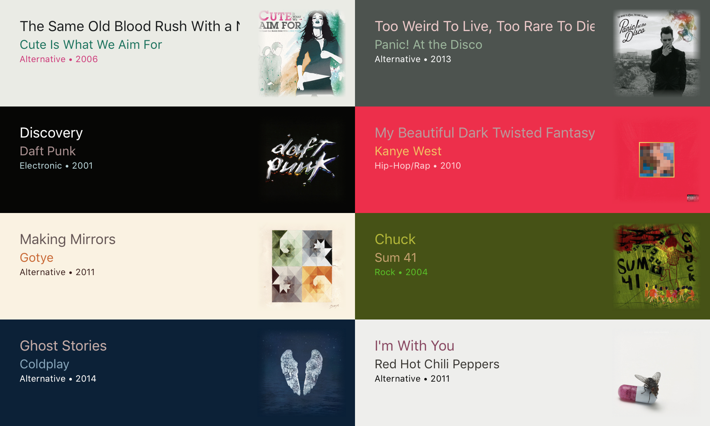

# ColorArtwork

[](https://travis-ci.org/XQS6LB3A/ColorArtwork)


[](LICENSE)

Swift-based iTunes 11-style color matching code. Inspired by [Panic Blog](https://panic.com/blog/itunes-11-and-colors/)



## Requirements

- macOS 10.10+ / iOS 8.0+ / tvOS 9.0+ / watchOS 2.0+
- Xcode 8+
- Swift 3.0+

## Installation

### [Carthage](https://github.com/Carthage/Carthage)

Add the project to your `Cartfile`:

```
github "XQS6LB3A/ColorArtwork"
```

### [Swift Package Manager](https://github.com/apple/swift-package-manager)

Add the project to your `Package.swift` file:

```
let package = Package(
    dependencies: [
        .Package(url: "https://github.com/XQS6LB3A/ColorArtwork", majorVersion: 0)
    ]
)
```

## Usage

```
import ColorArtwork
```

```
let colorArtwork = CAColorArtwork(image: AN_IMAGE)

colorArtwork.analyze()

colorArtwork.backgroundColor
colorArtwork.primaryColor
colorArtwork.secondaryColor
colorArtwork.detailColor
```

## License

ColorArtwork is available under the MIT license. See the [LICENSE file](LICENSE).

